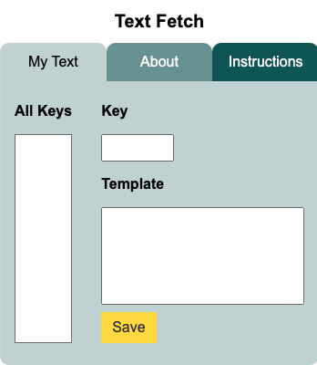

# Text Fetch (under construction)

<em>Text Fetch</em> is a plugin used for inserting text templates in various text fields that are displayed in the Chrome browser.

## View Project

- This project is still under construction, but you can still play around with with it's inner features (adding, editing, or deleting a key/template pair).

- You can view the Text Fetch UI [here](https://text-fetch.netlify.app/), or just enter <em>https://text-fetch.netlify.app/</em> in your browser's address bar.

## Built with

- create-react-app

- [Sass](https://sass-lang.com/)

- [uuid](https://www.npmjs.com/package/uuid)
